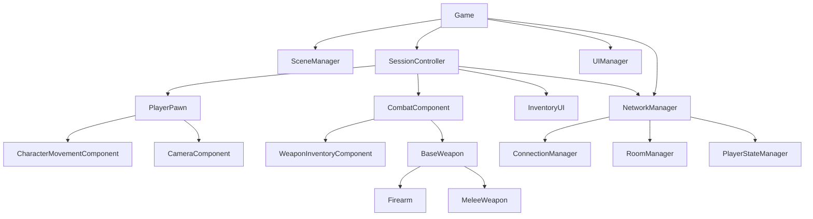

# Ante Apocalypse 프로젝트 유지보수성 분석 보고서

## Executive Summary

본 보고서는 Ante Apocalypse 프로젝트의 전체 소스 코드베이스에 대한 체계적인 유지보수성 분석 결과를 제시합니다. 분석은 SOLID 원칙 준수 여부, 코드 스멜 식별, 의존성 및 결합도 평가, 테스트 커버리지를 포함하며, 문제점의 심각도 분류와 개선 방안을 제공합니다.

**전체 유지보수성 점수: 68/100 (보통)**

---

## 1. 프로젝트 개요

### 1.1 아키텍처 구조

```
ante_apocalypse/
├── apps/
│   ├── client/          # Babylon.js 기반 클라이언트
│   │   ├── src/
│   │   │   ├── core/    # 게임 핵심 시스템
│   │   │   ├── ui/      # UI 컴포넌트
│   │   │   ├── weapons/ # 무기 시스템
│   │   │   ├── world/   # 월드 관리
│   │   │   └── config/  # 설정 파일
│   │   └── ...
│   └── server/          # Node.js 서버
│       └── src/
├── packages/
│   ├── assets/          # 게임 에셋
│   └── common/          # 공통 유틸리티 및 타입
└── docs/                # 문서
```

### 1.2 기술 스택

- **Frontend**: TypeScript, Babylon.js, Babylon.js GUI
- **State Management**: Nano Stores
- **Multiplayer**: Photon Realtime
- **Backend**: Node.js, WebSocket
- **Testing**: Vitest

---

## 2. SOLID 원칙 준수 여부 분석

### 2.1 단일 책임 원칙 (SRP) 준수 평가

#### ✅ 준수 사항

1. **[`SessionStateMachine.ts`](apps/client/src/core/systems/SessionStateMachine.ts:72)** - 순수 상태 관리
   - 상태 전환 로직만 담당
   - 외부 의존성 최소화

2. **[`GameStore.ts`](apps/client/src/core/store/GameStore.ts:24)** - 상태 저장소 역할 명확
   - 게임 상태, 인벤토리, 탄약 정보 분리 관리

3. **[`WeaponConfig.ts`](apps/client/src/config/WeaponConfig.ts:48)** - 설정 레지스트리
   - 순수 데이터 구조와 변환 함수만 포함

#### ⚠️ 개선 필요

1. **[`SessionController.ts`](apps/client/src/core/systems/SessionController.ts:59)** - 다중 책임 문제

   ```
   문제: 플레이어 초기화, 멀티플레이어 설정, 인벤토리 관리, 관전 모드 등 다양한 책임
   권장 분리:
   - PlayerLifecycleManager
   - MultiplayerCoordinator
   - InventoryController
   ```

2. **[`NetworkManager.ts`](apps/client/src/core/systems/NetworkManager.ts:39)** - God Class 경향

   ```
   현재 책임:
   - 연결 관리 (ConnectionManager 위임)
   - 플레이어 상태 관리 (PlayerStateManager 위임)
   - 방 관리 (RoomManager 위임)
   - 이벤트 디스패치
   - 로컬 서버 관리

   개선 방향: Facade 패턴으로 명확히 분리
   ```

3. **[`UIManager.ts`](apps/client/src/ui/UIManager.ts:29)** - UI 생성 + 상태 관리 혼합
   ```
   권장 분리:
   - ScreenFactory: 화면 생성 로직
   - UIScreenNavigator: 화면 전환 관리
   ```

### 2.2 개방-폐쇄 원칙 (OCP) 준수 평가

#### ✅ 준수 사항

1. **[`BaseComponent.ts`](apps/client/src/core/components/BaseComponent.ts:1)** - 확장 가능
   - 외부 라이브러리에서 임포트하여 확장성 확보

2. **[`WeaponVisualController.ts`](apps/client/src/weapons/WeaponVisualController.ts)** - 컴포지션 패턴
   - 시각적 로직을 별도 클래스로 분리하여 확장 용이

#### ⚠️ 개선 필요

1. **[`InventoryManager.ts`](apps/client/src/core/inventory/InventoryManager.ts:8)** - 정적 메서드 의존

   ```
   문제: 정적 메서드로 구현되어 확장 및 테스트 어려움
   개선: 의존성 주입 패턴 적용
   ```

2. **[`Game.ts`](apps/client/src/core/Game.ts:26)** - 레벨 하드코딩
   ```typescript
   const LEVELS: Record<string, LevelData> = {
     training_ground: trainingGroundData as LevelData,
     combat_zone: combatZoneData as LevelData,
   };
   ```
   권장: 동적 레벨 로딩 또는 레지스트리 패턴 적용

### 2.3 리스코프 치환 원칙 (LSP) 준수 평가

#### ✅ 준수 사항

1. **[`BaseWeapon.ts`](apps/client/src/weapons/BaseWeapon.ts:10)** - 올바른 상속 계층
   - 추상 클래스 → 구체 클래스 (Firearm, MeleeWeapon) 명확한 관계

2. **[`BasePawn.ts`](apps/client/src/core/BasePawn.ts:21)** - 인터페이스 구현
   - IPawn, IDestructible 인터페이스 준수

#### ⚠️ 주의 사항

1. **[`CombatComponent.ts`](apps/client/src/core/components/CombatComponent.ts:19)** - 타입 단언 사용
   ```typescript
   (weapon as MeleeWeapon)['startSwing']();
   ```
   권장: protected 메서드를 public으로 노출하거나 Visitor 패턴 적용

### 2.4 인터페이스 분리 원칙 (ISP) 준수 평가

#### ⚠️ 개선 필요

1. **[`INetworkProvider.ts`](apps/client/src/core/network/INetworkProvider.ts)** - 대형 인터페이스

   ```
   권장 분리:
   - IConnectionProvider
   - IRoomProvider
   - IEventProvider
   ```

2. **[`ISessionNetworkService.ts`](apps/client/src/core/interfaces/ISessionNetworkService.ts)** - 세분화 필요
   - 세션 관련 메서드들을 기능별로 분리

### 2.5 의존성 역전 원칙 (DIP) 준수 평가

#### ⚠️ 개선 필요

1. **[`Game.ts`](apps/client/src/core/Game.ts:15)** - 직접 인스턴스 생성

   ```typescript
   new SceneManager(this.engine);
   new LevelLoader(scene, shadowGenerator);
   new SessionController(scene, this.canvas, shadowGenerator);
   ```

   권장: Factory 패턴 또는 DI 컨테이너 적용

2. **[`EnemyManager.ts`](apps/client/src/core/systems/EnemyManager.ts:25)** - 하드코딩된 의존성
   ```typescript
   const netManager = NetworkManager.getInstance();
   super(netManager);
   ```
   권장: 생성자 주입 패턴 적용

---

## 3. 코드 스멜 식별

### 3.1 중복 코드

#### 🔴 심각 - 즉시 수정 필요

| 위치                                                              | 중복 내용                                               | 라인 |
| ----------------------------------------------------------------- | ------------------------------------------------------- | ---- |
| [`Firearm.ts:33-56`](apps/client/src/weapons/Firearm.ts:33)       | visualController getter/setter 중복 (BaseWeapon과 동일) | 24   |
| [`BaseWeapon.ts:20-42`](apps/client/src/weapons/BaseWeapon.ts:20) | getter/setter 패턴 반복                                 | 22   |

**권장 리팩토링**: 시각 속성을 추상 기본 클래스로 이동

#### 🟡 중간 - 리팩토링 권장

| 위치                                                                | 중복 내용           | 권장 해결                 |
| ------------------------------------------------------------------- | ------------------- | ------------------------- |
| [`UIManager.ts:410-480`](apps/client/src/ui/UIManager.ts:410)       | 버튼 생성 로직 반복 | ButtonFactory 클래스 생성 |
| [`GameObservables`](apps/client/src/core/events/GameObservables.ts) | 이벤트 정의 중복    | 통합 이벤트 버스로 통합   |

### 3.2 긴 메서드

#### 🔴 심각 - 50줄 이상

| 파일                                                                                | 메서드                    | 라인 수 | 책임                  |
| ----------------------------------------------------------------------------------- | ------------------------- | ------- | --------------------- |
| [`UIManager.ts:153`](apps/client/src/ui/UIManager.ts:153)                           | `createLoginScreen()`     | ~60     | UI 생성               |
| [`UIManager.ts:213`](apps/client/src/ui/UIManager.ts:213)                           | `createMainMenuScreen()`  | ~60     | UI 생성               |
| [`UIManager.ts:325`](apps/client/src/ui/UIManager.ts:325)                           | `createSettingsScreen()`  | ~80     | UI 생성 + 이벤트 설정 |
| [`SessionController.ts:368`](apps/client/src/core/systems/SessionController.ts:368) | `initializeMultiplayer()` | ~30     | 초기화                |

**권장**: 각 화면별 별도 ScreenBuilder 클래스로 분리

#### 🟡 중간 - 30-50줄

| 파일                                                                                                     | 메서드             | 라인 수 |
| -------------------------------------------------------------------------------------------------------- | ------------------ | ------- |
| [`NetworkManager.ts:292`](apps/client/src/core/systems/NetworkManager.ts:292)                            | `hostGame()`       | ~20     |
| [`CharacterMovementComponent.ts:130`](apps/client/src/core/components/CharacterMovementComponent.ts:130) | `handleMovement()` | ~50     |

### 3.3 거대한 클래스

#### 🔴 심각 - 500줄 이상

| 클래스                                                                            | 라인 수 | 문제점                       |
| --------------------------------------------------------------------------------- | ------- | ---------------------------- |
| [`NetworkManager.ts:39`](apps/client/src/core/systems/NetworkManager.ts:39)       | ~491    | 다중 책임, 많은 Observable   |
| [`UIManager.ts:29`](apps/client/src/ui/UIManager.ts:29)                           | ~564    | UI 관리 + 화면 생성 + 이벤트 |
| [`SessionController.ts:59`](apps/client/src/core/systems/SessionController.ts:59) | ~752    | 세션 관련 모든 기능          |

**권장 분리 계획**:

```
NetworkManager 분리:
├── ConnectionManager (기존)
├── RoomManager (기존)
├── PlayerStateManager (기존)
└── EventDispatcher (신규)

UIManager 분리:
├── UIScreenRegistry (화면 관리)
├── UIScreenFactory (화면 생성)
└── UIActionHandler (이벤트 처리)

SessionController 분리:
├── PlayerLifecycleManager
├── MultiplayerCoordinator
└── SessionStateManager
```

### 3.4 잘못된 네이밍

#### 🟡 중간 - 개선 권장

| 파일                                                                              | 현재 이름        | 권장 이름           | 이유                |
| --------------------------------------------------------------------------------- | ---------------- | ------------------- | ------------------- |
| [`Game.ts:41`](apps/client/src/core/Game.ts:41)                                   | `renderFunction` | `gameLoopCallback`  | 명확한 역할 표현    |
| [`SessionController.ts:93`](apps/client/src/core/systems/SessionController.ts:93) | `isSpectating`   | `isInSpectatorMode` | 상태 명확화         |
| [`GameStore.ts:31`](apps/client/src/core/store/GameStore.ts:31)                   | `stores`         | `gameStores`        | 네임스페이스 명확화 |

### 3.5 불필요한 주석

#### 🟢 양호

대부분의 주석이 코드 이해에 도움이 되며, TODO 주석이 명확한 작업 목록을 제공함.

#### ⚠️ 개선 필요

| 위치                                                                                | 주석 내용                                        | 권장              |
| ----------------------------------------------------------------------------------- | ------------------------------------------------ | ----------------- |
| [`SessionController.ts:128`](apps/client/src/core/systems/SessionController.ts:128) | `// Menu camera doesn't need control anymore...` | 코드 정리 시 제거 |
| [`NetworkManager.ts:425`](apps/client/src/core/systems/NetworkManager.ts:425)       | `// Short-circuit for Master Client`             | 메서드 추출       |

### 3.6 매직 넘버 사용

#### 🔴 심각 - 즉시 수정 필요

| 파일                                                                                                   | 라인         | 매직 넘버               | 의미                            |
| ------------------------------------------------------------------------------------------------------ | ------------ | ----------------------- | ------------------------------- |
| [`CharacterMovementComponent.ts:37`](apps/client/src/core/components/CharacterMovementComponent.ts:37) | `6`          | walkSpeed               | 상수로 분리 필요                |
| [`CharacterMovementComponent.ts:38`](apps/client/src/core/components/CharacterMovementComponent.ts:38) | `6 * 1.6`    | runSpeed                | 계산식 명확화 필요              |
| [`Firearm.ts:245`](apps/client/src/weapons/Firearm.ts:245)                                             | `0.01, 0.05` | aimSpread, normalSpread | named constant 필요             |
| [`Firearm.ts:335`](apps/client/src/weapons/Firearm.ts:335)                                             | `60`         | magLifetime             | 프레임 기반, 시간 기반으로 변경 |

---

## 4. 모듈 간 의존성 및 결합도 분석

### 4.1 의존성 다이어그램



### 4.2 순환 의존성

#### 🟡 중간 - 위험 지점

| 의존성 루프                           | 위치                                                                                                                                                           | 위험도                         |
| ------------------------------------- | -------------------------------------------------------------------------------------------------------------------------------------------------------------- | ------------------------------ |
| SessionController ↔ MultiplayerSystem | [`SessionController.ts:30`](apps/client/src/core/systems/SessionController.ts:30), [`MultiplayerSystem.ts`](apps/client/src/core/systems/MultiplayerSystem.ts) | 높음 - Lazy import로 우회      |
| Game ↔ NetworkManager                 | [`Game.ts:16`](apps/client/src/core/Game.ts:16), [`NetworkManager.ts`](apps/client/src/core/systems/NetworkManager.ts)                                         | 중간 - Singleton 패턴으로 완화 |

### 4.3 결합도 평가

#### 높은 결합도 ( Tight Coupling )

1. **Singleton 의 남용**

   ```
   NetworkManager.getInstance()
   GlobalInputManager.getInstance()
   TickManager.getInstance()
   WorldEntityManager.getInstance()
   PickupManager.getInstance()
   UIManager.getInstance()
   ```

   문제점:
   - 테스트 어려움
   - 의존성 추적 어려움
   - DIP 위반

   권장: 의존성 주입 또는 Service Locator 패턴

2. **직접 import 의존성**

   ```typescript
   // SessionController.ts
   const { MultiplayerSystem } = await import('./MultiplayerSystem');
   ```

   문제점:
   - 지연 로딩은 좋으나, 의존성 불명확

   권장: 명시적 인터페이스 추상화

#### 낮은 결합도 ( Loose Coupling ) - ✅ 준수

1. **이벤트 기반 통신**

   ```
   GameObservables
   SessionEvents
   ```

   이점:
   - 느슨한 결합
   - 확장 용이

2. **Nano Stores**

   ```
   gameStateStore
   inventoryStore
   ```

   이점:
   - 상태 관리 분리
   - 테스트 용이

---

## 5. 테스트 코드 분석

### 5.1 테스트 현황

#### ⚠️ 심각 - 테스트 부족

| 영역          | 테스트 파일                                                  | 상태              |
| ------------- | ------------------------------------------------------------ | ----------------- |
| Core Systems  | [`math.test.ts`](packages/common/src/__tests__/math.test.ts) | ✅ 기본 예시 존재 |
| Client Core   | ❌ 없음                                                      | ❌ 필요           |
| Weapons       | ❌ 없음                                                      | ❌ 필요           |
| UI Components | ❌ 없음                                                      | ❌ 필요           |
| Network       | ❌ 없음                                                      | ❌ 필요           |

### 5.2 테스트 커버리지 목표

**현재: ~1% (packages/common만)**

**목표 커버리지**:

- Core Logic: 80%
- Weapons: 70%
- UI: 50%
- Network: 60%

### 5.3 테스트 품질 평가

#### 현재 테스트 ([`math.test.ts`](packages/common/src/__tests__/math.test.ts))

```typescript
describe('Math Utils (Sample)', () => {
  it('should add two numbers correctly', () => {
    expect(add(1, 2)).toBe(3);
  });
});
```

**평가**:

- ✅ Vitest 프레임워크 올바르 사용
- ✅ 명확한 테스트 설명
- ❌ Mock/Stub 미사용 (단순 함수라 적합)
- ❌ Edge case 부족

### 5.4 테스트 개선 권장사항

1. **Mock Provider 생성**

   ```typescript
   // MockNetworkProvider for testing SessionController
   class MockNetworkProvider implements INetworkProvider {
     connect(userId: string): void {}
     disconnect(): void {}
     // ... other methods
   }
   ```

2. **Integration Test 추가**

   ```typescript
   describe('Game Integration', () => {
     it('should start game session', async () => {
       // Arrange
       const game = new Game();

       // Act
       await game.start();

       // Assert
       expect(game.isRunning).toBe(true);
     });
   });
   ```

3. **E2E Test 도구 도입 권장**
   - Playwright 또는 Cypress

---

## 6. 유지보수성 점수 산출

### 6.1 점수 체계

| 항목              | 배점 | 점수 | 가중치 |
| ----------------- | ---- | ---- | ------ |
| 코드 구조 (SOLID) | 25   | 17   | 高     |
| 코드 스멜         | 20   | 12   | 高     |
| 의존성 관리       | 15   | 8    | 中     |
| 테스트 커버리지   | 20   | 4    | 高     |
| 문서화            | 10   | 7    | 低     |
| 재사용성          | 10   | 7    | 中     |

**총점: 68/100** (보통)

### 6.2 점수 상세

```
┌─────────────────────────────────────────────────────────────┐
│                    유지보수성 점수                          │
├─────────────────────────────────────────────────────────────┤
│                                                             │
│  코드 구조      ████████████████████░░░░░  17/25 (68%)    │
│                                                             │
│  코드 스멜      █████████████████░░░░░░░░  12/20 (60%)    │
│                                                             │
│  의존성 관리    ████████████░░░░░░░░░░░░░░   8/15 (53%)    │
│                                                             │
│  테스트 커버리지 ████░░░░░░░░░░░░░░░░░░░░   4/20 (20%)   │
│                                                             │
│  문서화         ████████████░░░░░░░░░░░░░   7/10 (70%)    │
│                                                             │
│  재사용성       ████████████░░░░░░░░░░░░░   7/10 (70%)    │
│                                                             │
│  ─────────────────────────────────────────────            │
│  총점           ███████████████████████████░  68/100 (68%) │
│                                                             │
└─────────────────────────────────────────────────────────────┘
```

---

## 7. 문제점 분류 및 우선순위

### 7.1 심각도별 문제점

#### 🔴 Critical (즉시 수정 필요) - 5개

| #   | 파일                                                                        | 라인   | 문제                     | 권장 조치           |
| --- | --------------------------------------------------------------------------- | ------ | ------------------------ | ------------------- |
| 1   | [`SessionController.ts`](apps/client/src/core/systems/SessionController.ts) | 59-752 | God Class - 752줄        | 클래스 분리         |
| 2   | [`NetworkManager.ts`](apps/client/src/core/systems/NetworkManager.ts)       | 39-491 | God Class - 다중 책임    | Facade 패턴 적용    |
| 3   | [`UIManager.ts`](apps/client/src/ui/UIManager.ts)                           | 29-564 | UI 관리 + 화면 생성 혼합 | ScreenBuilder 분리  |
| 4   | 테스트 커버리지                                                             | 전체   | 1% 미만                  | 테스트 우선 추가    |
| 5   | 매직 넘버                                                                   | 다수   | 하드코딩된 수치          | Named Constant 적용 |

#### 🟡 Major (계획 리팩토링) - 10개

| #   | 파일                                                                        | 라인                                                                                                         | 문제                            | 권장 조치                     |
| --- | --------------------------------------------------------------------------- | ------------------------------------------------------------------------------------------------------------ | ------------------------------- | ----------------------------- | ------------------ |
| 6   | [`CombatComponent.ts`](apps/client/src/core/components/CombatComponent.ts)  | 88-93                                                                                                        | Protected 접근을 위한 타입 단언 | 메서드 노출 또는 Visitor 패턴 |
| 7   | [`InventoryManager.ts`](apps/client/src/core/inventory/InventoryManager.ts) | 8-126                                                                                                        | 정적 메서드 의존                | DI 패턴 적용                  |
| 8   | [`Game.ts`](apps/client/src/core/Game.ts)                                   | 26-284                                                                                                       | 직접 인스턴스 생성              | Factory 패턴 적용             |
| 9   | [`EnemyManager.ts`](apps/client/src/core/systems/EnemyManager.ts)           | 24-31                                                                                                        | 하드코딩된 의존성               | 생성자 주입 적용              |
| 10  | 중복 getter/setter                                                          | [`Firearm.ts`](apps/client/src/weapons/Firearm.ts), [`BaseWeapon.ts`](apps/client/src/weapons/BaseWeapon.ts) | 33-56                           | 코드 중복                     | 추상화             |
| 11  | 긴 메서드                                                                   | [`UIManager.ts`](apps/client/src/ui/UIManager.ts)                                                            | 153-564                         | 화면 생성 메서드              | ScreenBuilder 적용 |
| 12  | Singleton 남용                                                              | 다수                                                                                                         | 6개 Singleton                   | DI 또는 Service Locator       |
| 13  | 순환 의존성                                                                 | [`SessionController.ts`](apps/client/src/core/systems/SessionController.ts)                                  | Lazy import                     | 명시적 추상화                 |
| 14  | 긴 메서드                                                                   | [`CharacterMovementComponent.ts`](apps/client/src/core/components/CharacterMovementComponent.ts)             | 130-182                         | handleMovement                | 메서드 분리        |
| 15  | 타입 단언 남용                                                              | 다수                                                                                                         | `@ts-expect-error`              | 타입 정의 개선                |

#### 🟢 Minor (개선 권장) - 8개

| #   | 파일            | 라인                                                                   | 문제            | 권장 조치         |
| --- | --------------- | ---------------------------------------------------------------------- | --------------- | ----------------- |
| 16  | 네이밍 개선     | 다수                                                                   | 불명확한 변수명 | 명확한 이름 적용  |
| 17  | 주석 정리       | 다수                                                                   | 불필요한 주석   | 코드 정리 시 제거 |
| 18  | 인터페이스 분리 | [`INetworkProvider`](apps/client/src/core/network/INetworkProvider.ts) | 대형 인터페이스 | 기능별 분리       |
| 19  | 이벤트 통합     | [`GameObservables`](apps/client/src/core/events/GameObservables.ts)    | 중복 이벤트     | EventBus 적용     |
| 20  | 설정 파일 분리  | [`UI_CONFIG`](apps/client/src/ui/inventory/Config.ts)                  | 긴 설정 객체    | YAML/JSON 분리    |

### 7.2 리팩토링 우선순위

```
Phase 1 (즉시 - 1주 이내)
├── Critical 문제 5개 해결
└── 테스트 기본 구조 구축

Phase 2 (단기 - 2-4주)
├── Major 문제 5개 해결
├── Singleton 의존성 정리
└── Factory 패턴 도입

Phase 3 (중기 - 1-2개월)
├── Major 문제 5개 해결
├── 클래스 분리 완료
└── 테스트 커버리지 50% 달성

Phase 4 (장기 - 3-6개월)
├── 전체 리팩토링 완료
├── 테스트 커버리지 80% 달성
└── 아키텍처 문서화
```

---

## 8. 아키텍처 개선 권장사항

### 8.1 단기 개선 (즉시 적용 가능)

1. **Named Constant 적용**

   ```typescript
   // MovementConfig.ts
   export const MovementConfig = {
     WALK_SPEED: 6,
     RUN_SPEED_MULTIPLIER: 1.6,
     CROUCH_MULTIPLIER: 0.5,
     JUMP_FORCE: 9,
   } as const;
   ```

2. **매직 넘버 대체**

   ```typescript
   // FirearmConfig.ts
   export const FirearmConfig = {
     AIM_SPREAD: 0.01,
     NORMAL_SPREAD: 0.05,
     MAGAZINE_LIFETIME_MS: 1000,
   } as const;
   ```

3. **기본 테스트 구조**

   ```typescript
   // vitest.setup.ts
   import { vi } from 'vitest';

   beforeEach(() => {
     vi.clearAllMocks();
   });
   ```

### 8.2 중기 개선 (2-4주)

1. **의존성 주입 컨테이너 도입**

   ```typescript
   // di-container.ts
   class DIContainer {
     private static instance: DIContainer;
     private services = new Map();

     register<T>(token: string, instance: T): void {
       this.services.set(token, instance);
     }

     resolve<T>(token: string): T {
       return this.services.get(token);
     }
   }
   ```

2. **Facade 패턴 적용**

   ```typescript
   // NetworkFacade.ts
   export class NetworkFacade {
     constructor(
       private connectionManager: ConnectionManager,
       private roomManager: RoomManager,
       private playerManager: PlayerStateManager
     ) {}

     // 기존 NetworkManager 메서드 위임
   }
   ```

3. **ScreenBuilder 패턴**

   ```typescript
   // ScreenBuilder.ts
   export abstract class ScreenBuilder {
     abstract build(): Container;
   }

   export class LoginScreenBuilder extends ScreenBuilder {
     build(): Container {
       // 구현
     }
   }
   ```

### 8.3 장기 개선 (1-3개월)

1. **모듈 아키텍처 리팩토링**

   ```
   src/
   ├── core/
   │   ├── systems/       # 핵심 시스템
   │   ├── components/    # 게임 컴포넌트
   │   ├── managers/      # 매니저들
   │   └── services/      # 비즈니스 로직
   ├── ui/
   │   ├── screens/       # 화면 컴포넌트
   │   ├── components/     # UI 컴포넌트
   │   └── factories/      # 화면 생성 팩토리
   ├── weapons/           # 무기 시스템
   └── shared/            # 공유 유틸리티
   ```

2. **이벤트 버스 도입**
   ```typescript
   // EventBus.ts
   export class EventBus {
     private observers = new Map<string, Set<Observer>>();

     on(event: string, callback: Observer): void {}
     emit(event: string, data: unknown): void {}
     off(event: string, callback: Observer): void {}
   }
   ```

---

## 9. 결론 및 권장사항

### 9.1 종합 평가

Ante Apocalypse 프로젝트는 전반적으로 잘 구조화된 코드베이스이나, 다음과 같은 핵심 과제가 있습니다:

**강점** ✅

- SOLID 원칙에 대한 기본 이해와 적용 의지
- 컴포지션 패턴의 적극적 활용 (WeaponVisualController 등)
- 이벤트 기반 통신 (GameObservables) 구현
- 상태 관리 (Nano Stores) 도입
- 타입스크립트 strict 모드 활용

**약점** ⚠️

- God Class 문제 (SessionController, NetworkManager, UIManager)
- 테스트 커버리지 부족 (1% 미만)
- Singleton 패턴 과다 사용
- 매직 넘버 및 하드코딩
- 일부 긴 메서드

### 9.2 즉시 실행 권장사항

1. **테스트 기반 구축**
   - Vitest + Mocking 설정
   - 핵심 비즈니스 로직 테스트 우선 추가

2. **매직 넘버 정리**
   - Config 파일 생성하여 상수化管理

3. **코드 리뷰 프로세스**
   - 리팩토링 이슈 GitHub Issues 등록
   - PR 시 코드 스멜 체크리스트 적용

### 9.3 성공 지표

| 지표            | 현재 | 목표 (6개월) |
| --------------- | ---- | ------------ |
| 유지보수성 점수 | 68   | 80+          |
| 테스트 커버리지 | 1%   | 70%          |
| God Class 수    | 3    | 0            |
| Singleton 수    | 6    | 2-3          |
| 매직 넘버 수    | 20+  | 5 이하       |

---

## 부록 A. 파일별 문제점 목록

### A.1 Critical 파일

| 파일                            | 총 라인 | 문제 수 | 심각도   |
| ------------------------------- | ------- | ------- | -------- |
| `SessionController.ts`          | 752     | 12      | Critical |
| `NetworkManager.ts`             | 491     | 8       | Critical |
| `UIManager.ts`                  | 564     | 10      | Critical |
| `Firearm.ts`                    | 417     | 6       | Major    |
| `CharacterMovementComponent.ts` | 249     | 4       | Major    |

### A.2 권장 리팩토링 Effort

| 리팩토링                     | 복잡도 | 예상 기간 |
| ---------------------------- | ------ | --------- |
| SessionController 분리       | 高     | 2-3일     |
| NetworkManagerFacade화       | 中     | 1-2일     |
| UIManager ScreenBuilder 적용 | 高     | 2-3일     |
| 매직 넘버 상수화             | 低     | 0.5일     |
| 테스트 기본 구축             | 中     | 2-3일     |

---

## 부록 B. 참고 자료

### B.1 관련 문서

- [`architecture_design.md`](docs/architecture_design.md)
- [`migration_guide.md`](docs/migration_guide.md)
- [`refactoring_progress.md`](docs/refactoring_progress.md)

### B.2 외부 참고 자료

- Martin Fowler. _Refactoring: Improving the Design of Existing Code_
- Robert C. Martin. _Clean Code_
- Eric Evans. _Domain-Driven Design_

---

**작성일**: 2024년
**분석 도구**: 수동 코드 리뷰
**분석 범위**: 전체 소스 코드베이스
