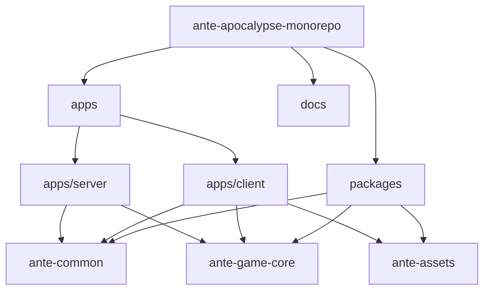

# Ante Apocalypse 아키텍처 분석 보고서

## Executive Summary

Ante Apocalypse 프로젝트에 대한 종합적인 분석을 통해 모노레포 아키텍처 전반에 걸친 중요한 구조적 비효율성, 숨겨진 결합, 유지보수 위험을 식별했습니다. 이 프로젝트는 Unreal Engine의 Controller-Pawn 패턴과 Unity 스타일의 Data-Driven 설계를 하이브리드로 구현하고 있으나, 코드 중복, 일관성 없는 오류 처리, 아키텍처 경계 위반 등의 상당한 기술 부채를 보여주고 있습니다.

---

## 1. 프로젝트 구조 개요

### 1.1 모노레포 아키텍처



### 1.2 패키지 의존성

| Package           | Dependencies                                                                                       | Purpose                          |
| ----------------- | -------------------------------------------------------------------------------------------------- | -------------------------------- |
| `@ante/client`    | `@ante/common`, `@ante/game-core`, `@ante/assets`, `@babylonjs/*`, `nanostores`, `photon-realtime` | 브라우저 기반 게임 클라이언트    |
| `@ante/server`    | `@ante/common`, `@ante/game-core`, `express`, `ws`, `photon-realtime`                              | 헤드리스 게임 서버               |
| `@ante/common`    | 없음                                                                                               | 공유 프로토콜, 타입, 유틸리티    |
| `@ante/game-core` | `@ante/common`, `@babylonjs/core`, `photon-realtime`                                               | 아이소모픽 게임 로직             |
| `@ante/assets`    | 없음                                                                                               | 정적 에셋 (모델, 사운드, 텍스처) |

---

## 2. 주요 발견사항

### 2.1 높은 우선순위: 코드 중복 및 보일러플레이트

#### 2.1.1 무기 시스템 중복

**위치**: `apps/client/src/weapons/Knife.ts` vs `apps/client/src/weapons/Bat.ts`

**문제**: 근접 무기에 대한 거의 동일한 구현 패턴:

- Lines 21-25: 동일한 애니메이션 상태 변수
- Lines 88-100: 동일한 swing() 메서드 구조
- Lines 130-133: 동일한 애니메이션 리셋 로직

**영향**: 유지보수 오버헤드, 일관성 없는 동작 위험

**권장사항**: 공통 근접 무기 동작을 `MeleeWeapon` 기본 클래스 또는 컴포지션 기반 `MeleeAnimationController`로 추출

#### 2.1.2 모델 로딩 중복

**위치**: `apps/client/src/weapons/Rifle.ts:38-60` vs `apps/client/src/weapons/Pistol.ts:35-60`

**문제**: 동일한 모델 정규화 코드:

```typescript
// 두 파일 모두 거의 동일한 코드 포함:
this.weaponMesh.parent = null;
this.weaponMesh.rotationQuaternion = null;
this.weaponMesh.rotation = Vector3.Zero();
this.weaponMesh.scaling = Vector3.One();
```

**권장사항**: `WeaponModelNormalizer` 유틸리티 클래스 생성

#### 2.1.3 위치/회전 복사 패턴

**영향**: 클라이언트 코드 전반에 27개의 `.copyFrom()` 패턴 발생

**권장사항**: 표준화된 변환 연산이 포함된 `TransformUtils` 생성

### 2.2 높은 우선순위: 아키텍처 패턴 위반

#### 2.2.1 Mixin 안티패턴 사용

**위치**: `apps/client/src/weapons/ClientWeaponMixin.ts`

**문제**: 복잡한 mixin 패턴이 다음을 생성:

- 타입 안전성 문제 (`@ts-expect-error` 필요)
- 코어와 시각적 로직 간 숨겨진 의존성
- 추적하기 어려운 메서드 해석 순서

**코드 증거**:

```typescript
// @ts-expect-error: Mixin return types can be complex
const VisualBaseWeapon = ClientWeaponMixin(CoreBaseWeapon);
```

**권장사항**: 컴포지션 패턴 또는 의존성 주입으로 대체

#### 2.2.2 Store 싱글톤 안티패턴

**위치**: `apps/client/src/core/store/GameStore.ts:6-16`

**문제**: Store 싱글톤을 위한 전역 window 객체 오염:

```typescript
declare global {
  interface Window {
    __GAME_STORES__?: { ... }
  }
}
```

**권장사항**: 적절한 의존성 주입 또는 React Context 패턴 사용

#### 2.2.3 Component-Pawn 결합

**위치**: 다수의 컴포넌트 파일

**문제**: 컴포넌트가 추상화 없이 직접 `owner.mesh`에 접근:

```typescript
// CharacterMovementComponent.ts, EnemyMovementComponent.ts 등
this.moveOwner.mesh.position.copyFrom(...)
```

**권장사항**: 위치/회전 접근을 위한 `ITransform` 인터페이스 정의

### 2.3 중간 우선순위: 설정 분산

#### 2.3.1 하드코딩된 매직 넘버

**위치**:

- `apps/client/src/core/CharacterPawn.ts:54-57`: 데미지 배율
- `apps/client/src/weapons/Rifle.ts:24-25`: 무기 스탯
- `apps/client/src/core/PlayerPawn.ts:63-64`: 충돌 타원체 치수

**권장사항**: `WeaponConfig`, `PhysicsConfig`, `DamageConfig` 파일로 중앙 집중화

#### 2.3.2 에셋 키 분산

**문제**: 에셋 키 ('rifle', 'gunshot', 'enemy')가 중앙 레지스트리 없이 여러 파일에 분산

**권장사항**: `AssetRegistry` enum 또는 상수 클래스 생성

### 2.4 중간 우선순위: 오류 처리 불일치

#### 2.4.1 혼합된 오류 처리 패턴

**28개 오류 처리 사이트 분석**:

| 패턴                    | 개수 | 위치                     |
| ----------------------- | ---- | ------------------------ |
| `throw new Error()`     | 12   | 무기 로딩, 에셋 로딩     |
| `try/catch with logger` | 10   | 네트워크 작업, 에셋 로딩 |
| `Promise.catch()`       | 4    | UI 작업                  |
| `if (!x) return`        | 2    | 가드 절                  |

**문제**: 일관된 오류 처리 전략 부재 - 일부 오류는 충돌, 일부는 로깅, 일부는 조용히 실패

**권장사항**: `Result<T, E>` 타입 또는 일관된 오류 경계 패턴 구현

#### 2.4.2 누락된 오류 복구

**위치**: `apps/client/src/core/Game.ts:219-221`

```typescript
try {
  this.engine.runRenderLoop(this.renderFunction);
} catch (e) {
  // 로딩 중 scene이 dispose되었는지 확인 (예: 사용자 종료)
  // 복구 로직 없음 - 빈 catch만 존재
}
```

### 2.5 낮은 우선순위: 테스트 및 문서화 공백

#### 2.5.1 최소한의 테스트 커버리지

**증거**: 존재하는 테스트 파일은 하나뿐:

- `packages/common/src/__tests__/math.test.ts`: 플레이스홀더 테스트

**테스트되지 않은 중요 영역**:

- 네트워크 프로토콜 직렬화
- 무기 발사 로직
- 데미지 계산
- 인벤토리 관리
- 상태 관리

#### 2.5.2 불완전한 문서화

**발견된 TODO**:

- `packages/game-core/src/simulation/WorldSimulation.ts:31`: AI 통합 대기 중
- `packages/game-core/src/rules/WaveSurvivalRule.ts:41`: 웨이브 관리 불완전

---

## 3. 확장성 및 성능 우려

### 3.1 상태 관리 병목현상

#### 3.1.1 Nanostores 구독 천이

**위치**: `apps/client/src/ui/HUD.ts:24-26`

**문제**: 배치 없이 여러 독립적인 구독:

```typescript
private curAmmoUnsub: (() => void) | null = null;
private scoreUnsub: (() => void) | null = null;
private healthUnsub: (() => void) | null = null;
```

**위험**: 고빈도 게임 이벤트 중 UI 업데이트 스래싱

### 3.2 네트워크 동기화 문제

#### 3.2.1 하드코딩된 동기화 간격

**위치**: `packages/game-core/src/systems/BaseEnemyManager.ts:13`

```typescript
protected syncInterval = 100; // 10Hz 동기화 - 설정 불가능
```

### 3.3 메모리 관리 위험

#### 3.3.1 Observer 누수 가능성

**위치**: `apps/client/src/core/systems/EnemyManager.ts:19-22`

```typescript
// eslint-disable-next-line @typescript-eslint/no-explicit-any
private _enemyUpdateObserver: Observer<any> | null = null;
```

**문제**: `any` 타입이 적절한 정리 확인을 방지

---

## 4. API 일관성 문제

### 4.1 일관성 없는 명명 규칙

| 패턴   | 예시                 | 불일치 항목                   |
| ------ | -------------------- | ----------------------------- |
| `onX`  | `onPlayerJoined`     | `playerDied` (on 없음)        |
| `getX` | `getMuzzleTransform` | `muzzleTransform` (직접 속성) |
| `isX`  | `isActive`           | `active` (일부 컴포넌트에서)  |

### 4.2 혼합된 비동기 패턴

**콜백**: `apps/client/src/weapons/BaseWeapon.ts:21`

```typescript
onScore?: (points: number) => void
```

**프로미스**: `apps/client/src/weapons/ClientWeaponMixin.ts:76`

```typescript
public async lower(): Promise<void>
```

**옵저버블**: `apps/client/src/core/events/GameObservables.ts:17`

```typescript
weaponFire: new Observable<...>()
```

---

## 5. 우선순위 기반 개선 로드맵

### Phase 1: 중요 (1-2주)

#### 5.1.1 공통 무기 동작 추출

**대상**: `apps/client/src/weapons/`

```typescript
// 제안: ProceduralWeaponBuilder.ts
export class ProceduralWeaponBuilder {
  static createMeleeWeapon(config: MeleeWeaponConfig): AbstractMesh;
  static createFirearm(config: FirearmConfig): AbstractMesh;
  static normalizeModel(mesh: AbstractMesh): void;
}
```

**성공 기준**:

- Knife.ts와 Bat.ts가 각각 30줄 미만으로 감소
- 중복 메시 생성 코드 100% 제거

#### 5.1.2 적절한 오류 경계 구현

**대상**: `apps/client/src/core/`

```typescript
// 제안: ErrorBoundary.ts
export class ErrorBoundary {
  static wrap<T>(operation: () => T): Result<T, GameError>;
  static async wrapAsync<T>(operation: () => Promise<T>): Promise<Result<T, GameError>>;
}
```

**성공 기준**:

- 모든 오류 처리가 일관된 패턴 사용
- 오류 처리에서 `any` 타입 제로

### Phase 2: 높은 우선순위 (3-4주)

#### 5.2.1 Mixin 패턴을 컴포지션으로 대체

**대상**: `apps/client/src/weapons/ClientWeaponMixin.ts`

```typescript
// 제안: WeaponVisualController.ts
export class WeaponVisualController {
  constructor(
    private weapon: BaseWeapon,
    private scene: Scene,
    private camera: Camera
  ) {}

  show(): void;
  hide(): void;
  update(deltaTime: number): void;
}
```

#### 5.2.2 설정 중앙 집중화

**대상**: 새로운 `apps/client/src/config/` 디렉토리

```typescript
// 제안된 설정 구조
export const WeaponConfig = {
  rifle: { damage: 25, fireRate: 0.1, ... },
  pistol: { damage: 15, fireRate: 0.2, ... }
} as const;

export const PhysicsConfig = {
  playerEllipsoid: new Vector3(0.4, 0.875, 0.4),
  gravity: -9.81
} as const;
```

### Phase 3: 중간 우선순위 (5-6주)

#### 5.3.1 종합적인 테스트 구현

**대상**: 모든 패키지

**최소 커버리지 요구사항**:

- 네트워크 프로토콜 직렬화: 90%
- 무기 로직: 85%
- 데미지 계산: 90%
- 상태 관리: 80%

#### 5.3.2 API 표면 표준화

**대상**: 모든 공개 인터페이스

**명명 규칙 규칙**:

1. 이벤트: `on[PastTenseVerb]` (예: `onPlayerJoined`)
2. 불리언 속성: `is[Adjective]` (예: `isActive`)
3. 값 반환 메서드: `get[Noun]` (예: `getPosition`)
4. 비동기 작업: 항상 `Promise<T>` 반환

### Phase 4: 낮은 우선순위 (7-8주)

#### 5.4.1 성능 최적화

- 투사체를 위한 객체 풀링 구현
- 네트워크 패킷 배칭 추가
- Store 구독 패턴 최적화

#### 5.4.2 문서화 완성

- 모든 공개 메서드에 API 문서
- 아키텍처 결정 기록 (ADRs)
- 배포 및 운영 가이드

---

## 6. 측정 가능한 성공 기준

### 6.1 코드 품질 메트릭

| 메트릭          | 현재 | 목표 | 측정 방법                                 |
| --------------- | ---- | ---- | ----------------------------------------- |
| 코드 중복       | ~15% | <5%  | jscpd 또는 유사 도구                      |
| 테스트 커버리지 | ~2%  | >70% | Vitest 커버리지                           |
| 타입 안전성     | 87%  | >95% | TypeScript strict 모드                    |
| Any 타입        | 45+  | 0    | ESLint @typescript-eslint/no-explicit-any |

### 6.2 유지보수성 메트릭

| 메트릭         | 현재          | 목표       | 측정 방법                |
| -------------- | ------------- | ---------- | ------------------------ |
| 평균 파일 길이 | 180 lines     | <150 lines | cloc                     |
| 순환 복잡도    | 무기에서 높음 | 함수당 <10 | eslint-plugin-complexity |
| 의존성 순환    | 알 수 없음    | 0          | madge                    |

### 6.3 성능 메트릭

| 메트릭      | 현재        | 목표      | 측정 방법            |
| ----------- | ----------- | --------- | -------------------- |
| 번들 크기   | 알 수 없음  | <2MB 초기 | vite-bundle-analyzer |
| 메모리 누수 | 가능성 있음 | 0         | Chrome DevTools      |
| 프레임 시간 | 알 수 없음  | <16ms     | Babylon.js inspector |

---

## 7. 재검토가 필요한 아키텍처 결정

### 7.1 Mixin vs 컴포지션

**현재**: 무기 시각적 효과를 위한 Mixin 패턴
**재검토**: 컴포지션이 더 나은 타입 안전성과 테스트 용이성 제공

### 7.2 전역 Store vs DI

**현재**: 전역 window 기반 store
**재검토**: 의존성 주입이 더 나은 테스트와 모듈성 가능

### 7.3 Photon 네트워크 아키텍처

**현재**: 전반에 걸친 직접 Photon 통합
**재검토**: 추상 네트워크 레이어가 로컬 멀티플레이어 테스트 가능

---

## 8. 점진적 마이그레이션 전략

### 8.1 무기 시스템 리팩토링


### 8.2 오류 처리 마이그레이션

1. `Result<T, E>` 타입 생성
2. 새 코드에 오류 경계 추가
3. 기존 try/catch 블록 점진적 마이그레이션
4. 모든 `any` 오류 타입 제거

### 8.3 테스트 도입

1. 순수 유틸리티 함수부터 시작
2. 무기 발사에 대한 통합 테스트 추가
3. 네트워크 프로토콜 테스트 추가
4. 중요 경로에 대한 E2E 테스트 추가

---

## 9. 결론

Ante Apocalypse 프로젝트는 Controller-Pawn 패턴과 패키지 분리를 통해 견고한 아키텍처 기반을 보여줍니다. 그러나 다음 영역에서 상당한 기술 부채가 축적되었습니다:

1. **코드 중복** (특히 무기 시스템)
2. **일관성 없는 오류 처리** (혼합된 패턴)
3. **Mixin 안티패턴** (타입 안전성 문제)
4. **설정 분산** (매직 넘버)
5. **테스트 공백** (최소한의 커버리지)

우선순위 로드맵을 구현하면 다음을 달성할 수 있습니다:

- 코드 중복 60%+ 감소
- 모든 모듈에서 일관된 오류 처리
- 70%+ 테스트 커버리지
- 개선된 타입 안전성 (95%+)
- 멀티플레이어 기능을 위한 더 나은 확장성

**예상 노력**: 전체 구현에 8주
**위험 수준**: 중간 (핵심 시스템의 신중한 리팩토링 필요)
**권장 시작**: Phase 1 (중요) 항목 즉시 시작
