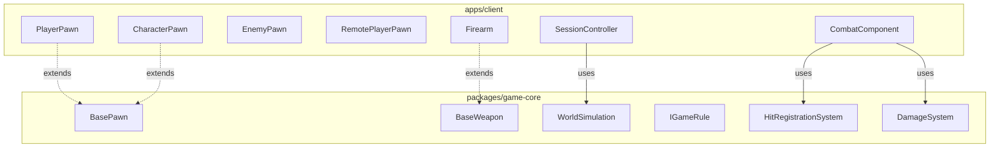
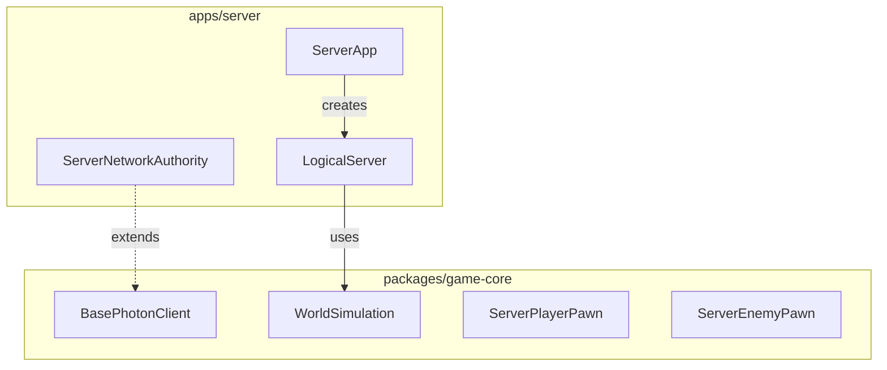

# 신규 콘텐츠 개발 구조 분석 및 권장사항

## 📋 Executive Summary

**분석 목적**: 현재 아키텍처가 신규 콘텐츠(게임 모드, 캐릭터, 무기) 추가에 적합한지 검증하고, 선행 리팩토링 필요 여부 판단

**결론**:

- ✅ **즉시 개발 가능**: 게임 모드(IGameRule), 무기(WeaponRegistry), 기본 캐릭터
- ⚠️ **부분적 개선 후 개발**: 고급 캐릭터 능력치 시스템, 복잡한 히트 판정
- 🔴 **선행 리팩토링 필요**: 타입 안전성, 네트워크 권한 경계, 테스트 커버리지

---

## 1. 패키지 경계 분석

### 1.1 apps/client ↔ packages/game-core 경계



**경계 명확성 평가**: ⭐⭐⭐⭐☆ (4/5)

| 항목            | 상태    | 설명                                                                               |
| --------------- | ------- | ---------------------------------------------------------------------------------- |
| **상속 관계**   | ✅ 명확 | Client Pawn들이 game-core BasePawn 상속                                            |
| **컴포지션**    | ✅ 명확 | WorldSimulation, GameRule은 인터페이스로 주입                                      |
| **타입 의존성** | ⚠️ 주의 | 일부 `any` 타입 존재 ([`IWeapon.getStats()`](apps/client/src/types/IWeapon.ts:41)) |
| **데이터 흐름** | ✅ 명확 | NetworkProtocol 통해 명확한 데이터 교환                                            |

**문제점**:

```typescript
// apps/client/src/types/IWeapon.ts:41
// eslint-disable-next-line @typescript-eslint/no-explicit-any
getStats(): Record<string, any>;  // ❌ 타입 안전성 부재
```

### 1.2 packages/server ↔ packages/game-core 경계



**경계 명확성 평가**: ⭐⭐⭐⭐⭐ (5/5)

Server는 game-core의 서버 측 기능을 적절히 활용하며, 명확한 분리가 되어 있습니다.

---

## 2. IGameRule 인터페이스 확장성 검증

### 2.1 현재 인터페이스 분석

```typescript
// packages/game-core/src/rules/IGameRule.ts
export interface IGameRule {
  readonly modeId: string;
  readonly allowRespawn: boolean;
  readonly respawnDelay: number;

  onInitialize(simulation: WorldSimulation): void;
  onUpdate(simulation: WorldSimulation, deltaTime: number): void;
  onPlayerJoin(simulation: WorldSimulation, playerId: string): void;
  onPlayerLeave(simulation: WorldSimulation, playerId: string): void;
  onPlayerDeath(simulation: WorldSimulation, playerId: string, killerId?: string): RespawnDecision;
  checkGameEnd(simulation: WorldSimulation): GameEndResult | null;
}
```

### 2.2 새 게임 모드 추가 시나리오: Capture The Flag

```typescript
// 새 게임 모드 추가 예시 - 현재 구조로 가능한지 검증
export class CaptureTheFlagRule implements IGameRule {
  public readonly modeId = 'ctf';
  public readonly allowRespawn = true;
  public readonly respawnDelay = 5;

  // ✅ 가능: 기본 상태 관리
  private teams: Map<string, 'red' | 'blue'> = new Map();
  private flags: Map<string, FlagState> = new Map();
  private scores: Map<string, number> = new Map();

  // ✅ 가능: 초기화
  public onInitialize(simulation: WorldSimulation): void {
    // 깃발 스폰
    this.spawnFlags(simulation);
    // 팀 기지 스폰
    this.spawnBases(simulation);
  }

  // ⚠️ 제한적: WorldSimulation에 깃발/기지 관리 기능이 없음
  private spawnFlags(simulation: WorldSimulation): void {
    // 현재 WorldSimulation은 enemies, pickups, targets만 관리
    // 깃발을 위한 추가 관리자 필요
    // 해결책 1: Pickup으로 위장 (제한적)
    // simulation.pickups.spawnPickup(...)
    // 해결책 2: Custom Entity Manager 필요 (리팩토링 필요)
    // this.customEntityManager.spawnEntity('flag', ...)
  }

  // ✅ 가능: 플레이어 이벤트 처리
  public onPlayerDeath(
    simulation: WorldSimulation,
    playerId: string,
    killerId?: string
  ): RespawnDecision {
    // 깃발 드롭 처리
    if (this.isCarryingFlag(playerId)) {
      this.dropFlag(playerId);
    }

    return {
      action: 'respawn',
      delay: this.respawnDelay,
      position: this.getTeamSpawnPoint(playerId),
    };
  }

  // ⚠️ 제한적: 게임 종료 조건 체크
  public checkGameEnd(simulation: WorldSimulation): GameEndResult | null {
    // 점수 기반 종료 - 가능
    for (const [team, score] of this.scores.entries()) {
      if (score >= 3) {
        // 3점 선취
        return { winnerTeam: team, reason: 'Captured 3 flags' };
      }
    }
    return null;
  }
}
```

### 2.3 IGameRule 확장성 평가

| 기능              | 현재 지원    | 확장 필요                  | 우선순위 |
| ----------------- | ------------ | -------------------------- | -------- |
| **기본 규칙**     | ✅ 완전 지원 | -                          | -        |
| **팀 기반 게임**  | ⚠️ 부분 지원 | 팀 관리 유틸리티           | 중간     |
| **커스텀 엔티티** | ❌ 미지원    | IEntityManager 인터페이스  | 높음     |
| **시간 제한**     | ⚠️ 수동 구현 | 타이머 유틸리티            | 낮음     |
| **점수 시스템**   | ✅ 가능      | ScoreManager 유틸리티 권장 | 중간     |

**권장 개선사항**:

```typescript
// packages/game-core/src/rules/IGameRule.ts 개선안

export interface IGameRuleContext {
  simulation: WorldSimulation;
  // 추가 컨텍스트
  scoreManager: IScoreManager;
  teamManager: ITeamManager;
  timerManager: ITimerManager;
  entityFactory: IEntityFactory; // 커스텀 엔티티 생성
}

export interface IGameRule {
  // ... 기존 속성들

  // 개선된 메서드 시그니처
  onInitialize(context: IGameRuleContext): void;
  onUpdate(context: IGameRuleContext, deltaTime: number): void;
  // ...
}
```

---

## 3. SessionStateMachine 확장성 검증

### 3.1 현재 상태 머신 분석

```typescript
// apps/client/src/core/systems/SessionStateMachine.ts
export enum SessionState {
  IDLE = 'IDLE',
  INITIALIZING = 'INITIALIZING',
  CONNECTING = 'CONNECTING',
  LOADING = 'LOADING',
  PLAYING = 'PLAYING',
  PAUSED = 'PAUSED',
  SPECTATING = 'SPECTATING',
  DISCONNECTING = 'DISCONNECTING',
  DISPOSED = 'DISPOSED',
  ERROR = 'ERROR',
}
```

### 3.2 새로운 게임 모드에 필요한 상태 추가 시나리오

```typescript
// 예: 토너먼트 모드를 위한 상태 추가
export enum SessionState {
  // ... 기존 상태들

  // 새로운 상태들
  MATCHMAKING = 'MATCHMAKING', // 매칭 중
  WAITING_FOR_PLAYERS = 'WAITING', // 플레이어 대기
  INTERMISSION = 'INTERMISSION', // 라운드 간 휴식
  VOTING = 'VOTING', // 맵/모드 투표
}

// VALID_TRANSITIONS에 추가 필요
const VALID_TRANSITIONS: Record<SessionState, SessionState[]> = {
  // ... 기존 전환들

  [SessionState.MATCHMAKING]: [SessionState.CONNECTING, SessionState.ERROR],
  [SessionState.WAITING_FOR_PLAYERS]: [SessionState.LOADING, SessionState.DISCONNECTING],
  [SessionState.INTERMISSION]: [SessionState.PLAYING, SessionState.VOTING],
  [SessionState.VOTING]: [SessionState.LOADING, SessionState.INTERMISSION],
};
```

### 3.3 SessionStateMachine 확장성 평가

| 확장 시나리오   | 난이도    | 설명                               |
| --------------- | --------- | ---------------------------------- |
| **상태 추가**   | 🟢 쉬움   | VALID_TRANSITIONS에 추가만 하면 됨 |
| **상태별 행동** | 🟡 중간   | StateHandler 인터페이스 필요       |
| **중첩 상태**   | 🔴 어려움 | Hierarchical State Machine 필요    |

**현재 구조로는 충분**하나, 복잡한 모드(토너먼트, 로비 시스템)를 위해서는 다음 개선 권장:

```typescript
// 개선된 State Machine
export interface StateHandler {
  onEnter(from: SessionState): void;
  onExit(to: SessionState): void;
  onUpdate(deltaTime: number): void;
}

export class SessionStateMachine {
  private handlers: Map<SessionState, StateHandler> = new Map();

  registerHandler(state: SessionState, handler: StateHandler): void {
    this.handlers.set(state, handler);
  }

  transitionTo(newState: SessionState): void {
    const currentHandler = this.handlers.get(this.currentState);
    const newHandler = this.handlers.get(newState);

    currentHandler?.onExit(newState);
    // ... 전환 로직
    newHandler?.onEnter(this.currentState);
  }
}
```

---

## 4. HitRegistrationSystem/DamageSystem 확장성 검증

### 4.1 현재 시스템 분석

```typescript
// packages/game-core/src/systems/HitRegistrationSystem.ts
export class HitRegistrationSystem {
  public static validateHit(
    scene: Scene,
    targetId: string,
    origin: Vector3,
    direction: Vector3,
    targetMesh: AbstractMesh,
    margin: number = 0.8
  ): HitValidationResult {
    // 1. 엄격한 레이캐스트
    // 2. 관대한 판정 (Lenient)
  }
}

// packages/game-core/src/systems/DamageSystem.ts
export class DamageSystem {
  public static calculateDamage(
    baseDamage: number,
    part: string = 'body',
    profile?: DamageProfile
  ): number {
    // 부위별 배율 적용
  }
}
```

### 4.2 새로운 히트 판정 메커니즘 추가 시나리오

```typescript
// 예: 폭발물(Explosion) 히트 판정 추가

// ✅ 가능: 기존 시스템 확장
export class ExplosionHitSystem {
  public static calculateExplosionDamage(
    center: Vector3,
    radius: number,
    maxDamage: number,
    entities: IWorldEntity[]
  ): Map<string, number> {
    const damages = new Map<string, number>();

    for (const entity of entities) {
      const distance = Vector3.Distance(center, entity.position);
      if (distance <= radius) {
        // 거리 기반 감쇠
        const falloff = 1 - distance / radius;
        const damage = Math.floor(maxDamage * falloff);
        damages.set(entity.id, damage);
      }
    }

    return damages;
  }
}

// ⚠️ 제한적: 관통(Overpenetration) 판정
export class PenetrationHitSystem {
  public static validatePenetrationHit(
    scene: Scene,
    origin: Vector3,
    direction: Vector3,
    maxPenetrations: number,
    damageFalloffPerHit: number
  ): PenetrationHitResult[] {
    // 현재 HitScanSystem은 단일 히트만 반환
    // 여러 히트를 반환하려면 새로운 메서드 필요

    const hits: PenetrationHitResult[] = [];
    let currentOrigin = origin;
    let remainingPenetrations = maxPenetrations;
    let currentDamage = 100; // 기본 데미지

    while (remainingPenetrations > 0) {
      const hit = HitScanSystem.doRaycast(scene, currentOrigin, direction, 100);
      if (!hit.hit) break;

      hits.push({
        targetId: hit.pickedMesh?.metadata?.id,
        damage: currentDamage,
        point: hit.pickedPoint,
      });

      // 관통 지속
      currentOrigin = hit.pickedPoint!.add(direction.scale(0.01));
      currentDamage *= 1 - damageFalloffPerHit;
      remainingPenetrations--;
    }

    return hits;
  }
}
```

### 4.3 확장성 평가

| 기능                 | 현재 지원    | 확장 난이도                |
| -------------------- | ------------ | -------------------------- |
| **레이캐스트 히트**  | ✅ 완전 지원 | -                          |
| **근접 공격**        | ✅ 가능      | HitScanSystem에 추가       |
| **폭발/스플래시**    | ⚠️ 부분 지원 | 새 시스템 필요             |
| **관통**             | ❌ 미지원    | HitScanSystem 수정 필요    |
| **DOT(지속 데미지)** | ⚠️ 수동 구현 | DamageOverTime 시스템 권장 |
| **상태 이상**        | ❌ 미지원    | StatusEffect 시스템 필요   |

---

## 5. 새 캐릭터/무기 추가 시나리오

### 5.1 새 무기 추가: 저격총(Sniper Rifle)

```typescript
// 1. WeaponRegistry에 스탯 추가 (packages/game-core)
export const WeaponRegistry: Record<string, WeaponStats> = {
  // ... 기존 무기들

  SniperRifle: {
    name: 'Sniper Rifle',
    damage: 150, // 높은 데미지
    range: 200, // 긴 사거리
    magazineSize: 5,
    fireRate: 1.5, // 느린 연사
    reloadTime: 3.0,
  },
};

// 2. 클라이언트 구현 (apps/client)
export class SniperRifle extends Firearm {
  public firingMode = 'semi' as const;
  public recoilForce = 2.0; // 강한 반동

  // 특수 기능: 확대 조준
  private zoomLevel = 1;
  private maxZoom = 4;

  public toggleZoom(): void {
    this.zoomLevel = this.zoomLevel >= this.maxZoom ? 1 : this.zoomLevel * 2;
    // FOV 조정
  }

  // 특수 기능: 관통 샷
  protected override performHitScan(): void {
    // 관통 판정 로직 (HitScanSystem 확장 필요)
    const hits = PenetrationHitSystem.validatePenetrationHit(
      this.scene,
      this.getMuzzlePosition(),
      this.getAimDirection(),
      3, // 최대 3명 관통
      0.3 // 30% 데미지 감소 per 관통
    );

    for (const hit of hits) {
      this.applyDamage(hit.targetId, hit.damage);
    }
  }
}
```

**평가**:

- ✅ 기본 무기 추가: **즉시 가능**
- ⚠️ 특수 기능(관통): **HitScanSystem 확장 필요**
- ⚠️ 확대 조준: **CameraComponent 수정 필요**

### 5.2 새 캐릭터 추가: 보스 몬스터

```typescript
// 1. game-core에 ServerBossPawn 추가
export class ServerBossPawn extends ServerEnemyPawn {
  public override type = 'boss';

  // 보스 특수 능력
  private phase: number = 1;
  private maxPhases: number = 3;

  public override takeDamage(amount: number, attackerId?: string): void {
    const oldHealth = this.health;
    super.takeDamage(amount, attackerId);

    // 페이즈 전환 체크
    const healthPercent = this.health / this.maxHealth;
    const newPhase = Math.ceil(healthPercent * this.maxPhases);

    if (newPhase !== this.phase) {
      this.phase = newPhase;
      this.onPhaseChange();
    }
  }

  private onPhaseChange(): void {
    // 페이즈 변경 시 특수 능력 발동
    // 네트워크 동기화 필요
  }
}

// 2. 클라이언트에 BossPawn 추가
export class BossPawn extends CharacterPawn {
  public override type = 'boss';

  // 보스 UI (철바 등)
  private bossUI: BossUIComponent;

  constructor(scene: Scene, position: Vector3, shadowGenerator: ShadowGenerator) {
    super(scene, {
      assetKey: 'boss_model', // 새 에셋 필요
      type: 'enemy',
      position,
      shadowGenerator,
      healthBarStyle: 'boss', // 특수 철바 스타일
    });

    this.bossUI = new BossUIComponent(this, scene);
  }
}
```

**평가**:

- ✅ 기본 보스: **즉시 가능**
- ⚠️ 페이즈 시스템: **IGameRule과 연동 필요**
- ⚠️ 특수 UI: **HealthBarComponent 확장 필요**

---

## 6. 선행 리팩토링 필요 여부 판단

### 6.1 즉시 개발 가능 항목 (리팩토링 불필요)

| 항목                 | 이유                                |
| -------------------- | ----------------------------------- |
| **기본 게임 모드**   | IGameRule 인터페이스가 명확함       |
| **기본 무기**        | WeaponRegistry + 상속 구조가 안정적 |
| **기본 캐릭터/적**   | CharacterPawn 상속 구조가 명확함    |
| **간단한 히트 판정** | HitScanSystem이 충분함              |

### 6.2 부분적 개선 후 개발 가능

| 항목                     | 필요한 개선              | 예상 소요 |
| ------------------------ | ------------------------ | --------- |
| **팀 기반 게임 모드**    | TeamManager 유틸리티     | 1-2일     |
| **특수 무기(폭발/관통)** | HitScanSystem 확장       | 2-3일     |
| **보스 페이즈 시스템**   | IGameRuleContext 개선    | 1일       |
| **상태 이상 시스템**     | StatusEffect 시스템 신규 | 3-5일     |

### 6.3 선행 리팩토링 필요

| 항목                | 리팩토링 내용             | 우선순위 |
| ------------------- | ------------------------- | -------- |
| **타입 안전성**     | `any` → 구체적 타입       | 🔴 높음  |
| **네트워크 권한**   | AuthorityLevel 명확화     | 🔴 높음  |
| **테스트 커버리지** | 핵심 경로 테스트          | 🟡 중간  |
| **커스텀 엔티티**   | IEntityManager 인터페이스 | 🟡 중간  |

---

## 7. 구체적 권장사항

### 7.1 신규 콘텐츠 개발 우선순위

```
Phase 1 (즉시 시작):
├── 기본 게임 모드 2-3개 (Deathmatch 변형, 팀 데스매치)
├── 무기 3-5종 (기존 메커니즘 활용)
└── 적 타입 2-3종 (이동 패턴 변형)

Phase 2 (1-2주 개선 후):
├── 팀 기반 모드 (CTF, 점령전)
├── 폭발성 무기 (로켓 런처, 수류탄)
└── 특수 능력 적 (원거리 공격)

Phase 3 (리팩토링 후):
├── 보스 전투 (페이즈 시스템)
├── 상태 이상 (독, 스턴)
└── 복잡한 히트 판정 (관통, 리코셰)
```

### 7.2 개발 시 주의사항

```typescript
// ❌ 피해야 할 패턴
class BadExample {
  // any 타입 남용
  public getStats(): Record<string, any> { ... }

  // 직접 네트워크 상태 변경
  public takeDamage(amount: number): void {
    this.health -= amount;  // ❌ 서버 권한 무시
    networkManager.sendEvent(DAMAGE, { amount });  // ❌ 순서 잘못
  }
}

// ✅ 권장 패턴
class GoodExample {
  // 구체적 타입 사용
  public getStats(): WeaponStats { ... }

  // 서버 권한 존중
  public requestDamage(amount: number, attackerId: string): void {
    // 1. 서버에 요청
    networkManager.sendEvent(REQUEST_HIT, {
      targetId: this.id,
      damage: amount,
      attackerId,
    });

    // 2. 클라이언트 예측 (선택적)
    if (this.isLocalPlayer) {
      this.predictDamage(amount);
    }
  }

  // 서버 확인 후 실제 적용
  public applyDamage(confirmedAmount: number): void {
    this.health -= confirmedAmount;
  }
}
```

### 7.3 권장 개발 워크플로우

```
1. game-core에 공통 로직 구현
   └── 순수 로직, Babylon.js 의존성 최소화

2. client에 시각적 구현 추가
   └── extends game-core classes
   └── add visual components

3. server에 서버 권한 로직 추가 (필요시)
   └── extends game-core classes
   └── add validation logic

4. common에 네트워크 프로토콜 추가
   └── EventCode, payload interfaces

5. 테스트 작성
   └── unit tests in game-core
   └── integration tests (optional)
```

---

## 8. 결론

### 8.1 최종 판단

| 질문                            | 답변                                                  |
| ------------------------------- | ----------------------------------------------------- |
| **즉시 신규 콘텐츠 개발 가능?** | ✅ **예**, 기본 콘텐츠는 가능                         |
| **선행 리팩토링 필요?**         | ⚠️ **부분적으로**, 타입 안전성과 네트워크 권한만 개선 |
| **6개월 출시 가능?**            | ✅ **예**, 단계적 접근 시 가능                        |

### 8.2 권장 로드맵 수정안

**Month 1**:

- 병행: 기본 콘텐츠 개발 (무기 3종, 모드 2개) + 타입 안전성 개선
- 목표: `any` 타입 50% 감소

**Month 2**:

- 병행: 중급 콘텐츠 (CTF 모드, 폭발 무기) + 네트워크 권한 명확화
- 목표: 모든 데미지 처리에 서버 권한 체크 추가

**Month 3-4**:

- 고급 콘텐츠 개발 집중 (보스, 상태 이상)
- 리팩토링 비율 감소 (30% → 20%)

**Month 5-6**:

- 폴리싱 및 콘텐츠 완성
- 테스트 커버리지 확대

### 8.3 즉시 실행 권장사항

1. **오늘 시작 가능**:
   - [`DeathmatchRule`](packages/game-core/src/rules/DeathmatchRule.ts) 기반 새 모드 1개
   - [`WeaponRegistry`](packages/game-core/src/weapons/WeaponRegistry.ts)에 새 무기 1개

2. **이번 주 내 개선**:
   - [`IWeapon.getStats()`](apps/client/src/types/IWeapon.ts:41)의 `any` 타입 제거
   - [`BasePawn.takeDamage()`](packages/game-core/src/simulation/BasePawn.ts:52)에 권한 체크 추가

3. **다음 주 계획**:
   - 팀 기반 모드 프로토타입
   - 폭발 무기 기획

---

**문서 버전**: 1.0  
**작성일**: 2026-02-02  
**다음 검토**: 신규 콘텐츠 1개 개발 후 (약 1주 후)
