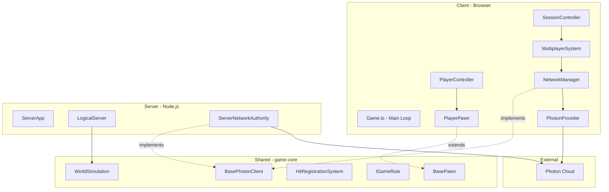
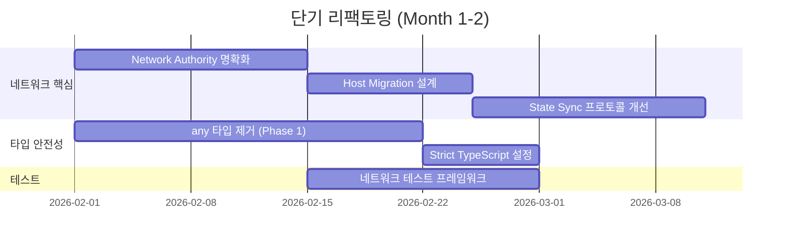
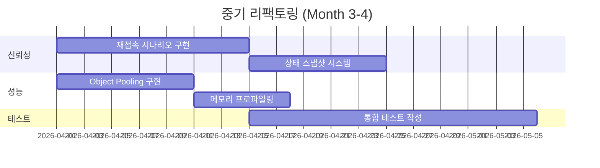
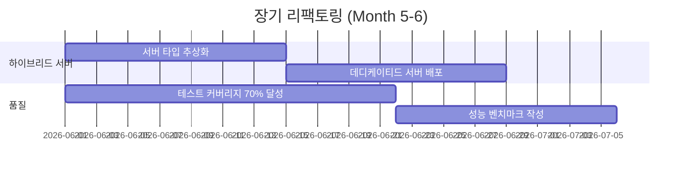
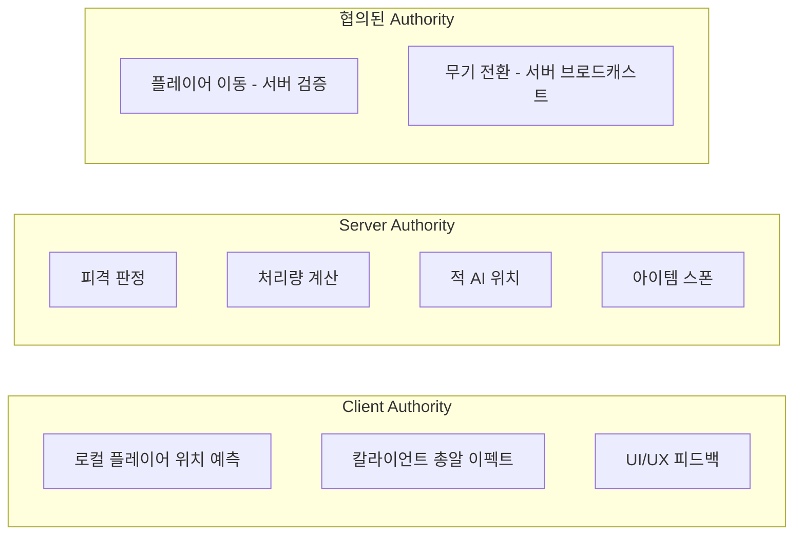
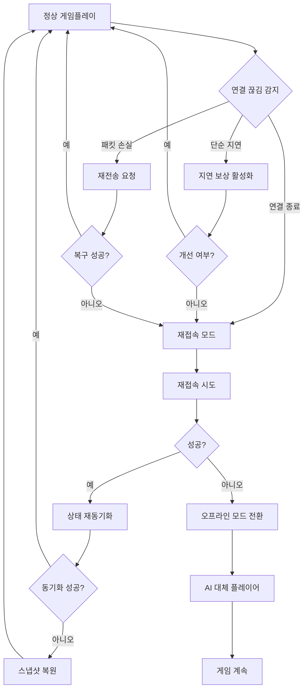

# Ante Apocalypse 리팩토링 로드맵 & 아키텍처 개선 전략

## 📋 Executive Summary

**프로젝트 현황**: 프로토타입 단계 → 6개월 내 정식 출시 목표  
**핵심 도전**: 서버-클리이언트 분리 → 방장 호스트(Listen Server) 아키텍처 전환 중 네트워크 동기화 불안정  
**개발 리소스**: 1인 개발, 시간 여유 있음  
**권장 접근법**: 단계적 리팩토링 + 기능 개발 병행 (기술 부채 30% / 기능 70% 비율)

---

## 🎯 1. 현재 아키텍처 분석

### 1.1 시스템 구조 개요



### 1.2 현재 아키텍처의 강점

| 영역         | 강점                      | 설명                                                     |
| ------------ | ------------------------- | -------------------------------------------------------- |
| **구조**     | Controller-Pawn 패턴      | Unreal Engine 스타일의 명확한 관심사 분리                |
| **데이터**   | Data-Driven Design        | JSON 기반 무기/레벨 설정, 밸런스 조정 용이               |
| **네트워크** | 추상화된 NetworkAuthority | INetworkAuthority 인터페이스로 클라이언트/서버 코드 공유 |
| **상태관리** | Session State Machine     | 명확한 상태 전환 및 유효성 검증                          |
| **컴포넌트** | ECS-like 구조             | BaseComponent 기반 모듈화된 기능 구성                    |

### 1.3 기술적 부채 분석

#### 🔴 Critical (즉시 해결 필요)

| ID     | 문제                    | 위험도   | 영향 범위       | 설명                                           |
| ------ | ----------------------- | -------- | --------------- | ---------------------------------------------- |
| TD-001 | 타입 안전성 부재        | **높음** | 전체 코드베이스 | `any`/`unknown` 남용으로 인한 런타임 에러 위험 |
| TD-002 | 네트워크 권한 경계 모호 | **높음** | 동기화 로직     | 클라이언트 예측 vs 서버 권한 구분 불명확       |
| TD-003 | Host Migration 미구현   | **높음** | 멀티플레이어    | 방장 이탈 시 게임 종료됨                       |
| TD-004 | 메모리 누수 가능성      | **중간** | 컴포넌트/옵저버 | Observer 해제 누락 가능성                      |

#### 🟡 High (1-2개월 내 해결)

| ID     | 문제                  | 위험도   | 영향 범위   | 설명                                |
| ------ | --------------------- | -------- | ----------- | ----------------------------------- |
| TD-005 | 테스트 커버리스 부재  | **중간** | 품질 보증   | 단위 테스트가 `math.test.ts`만 존재 |
| TD-006 | 에러 핸들링 불일치    | **중간** | 사용자 경험 | 일부 예외 처리 누락                 |
| TD-007 | 물리 엔진 미통합      | **중간** | 게임플레이  | Rapier.js 통합 예정이나 미구현      |
| TD-008 | 에셋 로딩 비동기 관리 | **중간** | 로딩 시간   | 병렬 로딩 및 진행률 추적 부재       |

#### 🟢 Medium (3-6개월 내 해결)

| ID     | 문제               | 위험도   | 영향 범위 | 설명                                |
| ------ | ------------------ | -------- | --------- | ----------------------------------- |
| TD-009 | 로깅 시스템 한계   | **낮음** | 디버깅    | 구조화된 로깅 및 원격 로깅 부재     |
| TD-010 | 설정 관리 분산     | **낮음** | 유지보수  | 환경변수/설정 파일 관리 일관성 부족 |
| TD-011 | 번들 사이즈 최적화 | **낮음** | 성능      | Tree-shaking 및 코드 분할 미적용    |

---

## 🛠️ 2. 리팩토링 우선순위 로드맵

### 2.1 단기 (Month 1-2): 네트워크 안정화 핵심

**목표**: 동기화 불안정 해결 및 Host Migration 기반 마련



#### Week 1-2: Network Authority 명확화

**문제**: 현재 클라이언트와 서버가 동일한 `INetworkAuthority`를 구현하지만, 권한 경계가 모호함

**해결 방안**:

```typescript
// packages/game-core/src/network/IAuthority.ts

export enum AuthorityLevel {
  None = 0, // 관찰자
  Predicted = 1, // 클라이언트 예측 (로컬만)
  Authoritative = 2, // 서버/호스트 권한
}

export interface IAuthority {
  readonly level: AuthorityLevel;
  readonly isHost: boolean;
  readonly isLocal: boolean;

  canModifyState(entityId: string): boolean;
  canSpawnEntity(type: EntityType): boolean;
  canDestroyEntity(entityId: string): boolean;
}

// 명확한 권한 체크 유틸리티
export function requireAuthority(authority: IAuthority, entityId: string): void {
  if (!authority.canModifyState(entityId)) {
    throw new AuthorityError(`Cannot modify ${entityId}: insufficient authority`);
  }
}
```

**적용 대상**:

- [`WorldSimulation.update()`](packages/game-core/src/simulation/WorldSimulation.ts:28)
- [`BasePawn.takeDamage()`](packages/game-core/src/simulation/BasePawn.ts:52)
- [`HitRegistrationSystem.validateHit()`](packages/game-core/src/systems/HitRegistrationSystem.ts:18)

#### Week 3-4: Host Migration 기반 설계

**문제**: 현재 방장 이탈 시 게임 종료

**해결 방안**:

```typescript
// packages/game-core/src/network/HostMigrationManager.ts

export interface HostMigrationManager {
  // 마스터 클라이언트 선출 알고리즘
  electNewHost(actors: Actor[]): string;

  // 상태 이전 프로토콜
  initiateMigration(oldHost: string, newHost: string): Promise<void>;

  // 상태 복구
  recoverState(snapshot: WorldSnapshot): void;

  // 마이그레이션 중 투명성 유지
  readonly isMigrating: boolean;
  readonly migrationProgress: number;
}

// 마이그레이션 우선순위 기준
const HOST_PRIORITY = [
  'lowest_latency', // 지연 시간이 가장 낮은 플레이어
  'longest_connected', // 가장 오래 연결된 플레이어
  'highest_spec', // 하드웨어 사양이 좋은 플레이어
] as const;
```

#### Week 5-6: State Sync 프로토콜 개선

**현재 문제점**:

- 128Hz 업데이트 ([`MultiplayerSystem.updateInterval`](apps/client/src/core/systems/MultiplayerSystem.ts:17))는 과도함
- 델타 압축 없이 전체 상태 전송
- 패킷 손실 시 복구 메커니즘 부재

**개선 방안**:

```typescript
// 개선된 동기화 전략
interface SyncStrategy {
  // 적응형 업데이트 레이트
  adaptiveRate: {
    baseHz: number; // 기본 30Hz
    maxHz: number; // 최대 60Hz
    minHz: number; // 최소 10Hz
    adjustByLatency: boolean; // 지연 시간에 따른 조정
  };

  // 델타 압축
  deltaCompression: {
    enabled: boolean;
    maxDeltaFrames: number; // 5프레임까지만 델타
    fallbackToFull: boolean; // 초과 시 전체 상태
  };

  // 중요도 기반 우선순위
  priorityQueue: {
    localPlayer: Priority.Critical;
    nearbyEnemies: Priority.High;
    distantPlayers: Priority.Low;
    staticObjects: Priority.None;
  };
}
```

#### Week 7-8: Type Safety 강화 (Phase 1)

**목표**: 핵심 네트워크/시뮬레이션 코드에서 `any` 제거

**우선순위 파일**:

1. [`packages/game-core/src/network/*.ts`](packages/game-core/src/network/)
2. [`packages/game-core/src/simulation/*.ts`](packages/game-core/src/simulation/)
3. [`apps/client/src/core/systems/NetworkManager.ts`](apps/client/src/core/systems/NetworkManager.ts)

---

### 2.2 중기 (Month 3-4): 신뢰성 및 성능

**목표**: 장애 복구, 재접속, 성능 최적화



#### Month 3: 재접속 및 상태 복구

**핵심 컴포넌트**:

```typescript
// packages/game-core/src/network/ReconnectionManager.ts

export class ReconnectionManager {
  // 재접속 시도 전략
  private retryStrategy: ExponentialBackoff = {
    initialDelay: 1000, // 1초
    maxDelay: 30000, // 30초
    multiplier: 2,
    maxAttempts: 10,
  };

  // 상태 재동기화
  async resyncState(): Promise<SyncResult> {
    // 1. 서버 시간 동기화
    const serverTime = await this.syncClock();

    // 2. 누락된 이벤트 재생
    const missedEvents = await this.requestEventHistory(this.lastAcknowledgedSequence);

    // 3. 현재 상태 요청
    const currentState = await this.requestFullState();

    // 4. 예측 상태와 병합
    return this.reconcileState(missedEvents, currentState);
  }

  // 지연 보상
  compensateLatency(localTime: number, serverTime: number): void {
    const delta = localTime - serverTime;
    if (delta > 100) {
      // 100ms 이상 차이
      this.adjustSimulationSpeed(1.1); // 10% 빠르게
    } else if (delta < -100) {
      this.adjustSimulationSpeed(0.9); // 10% 느리게
    }
  }
}
```

#### Month 4: 성능 최적화

**Object Pooling 구현**:

```typescript
// packages/game-core/src/utils/ObjectPool.ts

export class ObjectPool<T extends IPoolable> {
  private available: T[] = [];
  private inUse: Set<T> = new Set();
  private factory: () => T;
  private reset: (obj: T) => void;

  constructor(factory: () => T, reset: (obj: T) => void, initialSize: number = 10) {
    this.factory = factory;
    this.reset = reset;

    // 사전 할당
    for (let i = 0; i < initialSize; i++) {
      this.available.push(this.factory());
    }
  }

  acquire(): T {
    let obj: T;
    if (this.available.length > 0) {
      obj = this.available.pop()!;
    } else {
      obj = this.factory();
    }
    this.inUse.add(obj);
    return obj;
  }

  release(obj: T): void {
    if (this.inUse.has(obj)) {
      this.inUse.delete(obj);
      this.reset(obj);
      this.available.push(obj);
    }
  }
}

// 적용 대상
const pools = {
  projectiles: new ObjectPool(
    () => new Projectile(),
    (p) => p.reset()
  ),
  impactEffects: new ObjectPool(
    () => new ImpactEffect(),
    (e) => e.reset()
  ),
  networkPackets: new ObjectPool(
    () => new NetworkPacket(),
    (p) => p.reset()
  ),
};
```

---

### 2.3 장기 (Month 5-6): 아키텍처 완성

**목표**: 데디케이티드/리슨 서버 하이브리드 지원, 코드 품질 완성



#### Month 5-6: 하이브리드 서버 아키텍처

```typescript
// packages/game-core/src/server/ServerFactory.ts

export type ServerType = 'dedicated' | 'listen' | 'offline';

export interface ServerConfig {
  type: ServerType;
  region?: string;
  maxPlayers: number;
  tickRate: number;
  gameMode: string;
}

export class ServerFactory {
  static create(config: ServerConfig): GameServer {
    switch (config.type) {
      case 'dedicated':
        return new DedicatedServer(config);
      case 'listen':
        return new ListenServer(config);
      case 'offline':
        return new OfflineServer(config);
      default:
        throw new Error(`Unknown server type: ${config.type}`);
    }
  }
}

// 공통 인터페이스
export interface GameServer {
  readonly type: ServerType;
  readonly isAuthoritative: boolean;

  start(): Promise<void>;
  stop(): Promise<void>;

  // 권한 위임
  transferAuthority(to: string): Promise<void>;

  // 상태 저장/복원
  saveState(): Promise<StateSnapshot>;
  restoreState(snapshot: StateSnapshot): Promise<void>;
}
```

---

## 🔧 3. 네트워크 동기화 개선 전략 상세

### 3.1 동기화 모델 선택

| 모델               | 적합한 상황           | 구현 복잡도 | Ante Apocalypse 적용 |
| ------------------ | --------------------- | ----------- | -------------------- |
| **Lockstep**       | 턴 기반, RTS          | 높음        | ❌ 부적합            |
| **Deterministic**  | 물리 기반, 롤백 필요  | 매우 높음   | ❌ 부적합            |
| **State Sync**     | FPS, 빈번한 상태 변화 | 중간        | ✅ **채택**          |
| **Event Sourcing** | 로그 기반 복구        | 높음        | ⚠️ 보조로 사용       |

### 3.2 권한 경계 정의



### 3.3 클라이언트 예측 vs 서버 재조정

```typescript
// packages/game-core/src/network/PredictionReconciliation.ts

export class PredictionReconciliation {
  private pendingInputs: PlayerInput[] = [];
  private serverStates: Map<number, EntityState> = new Map();
  private lastProcessedInput: number = 0;

  // 클라이언트 측 예측
  predict(input: PlayerInput, currentState: EntityState): EntityState {
    // 로컬에서 즉시 적용
    const predicted = this.applyInput(currentState, input);
    this.pendingInputs.push(input);
    return predicted;
  }

  // 서버 상태 수신 시 재조정
  reconcile(serverState: EntityState, serverInputSequence: number): void {
    // 1. 서버가 처리한 입력까지 롤백
    const inputsToReplay = this.pendingInputs.filter((i) => i.sequence > serverInputSequence);

    // 2. 서버 상태로 리셋
    let state = serverState;

    // 3. 미처리 입력 재적용
    for (const input of inputsToReplay) {
      state = this.applyInput(state, input);
    }

    // 4. 차이가 클 경우만 스냅 (부드러운 보간)
    const diff = this.calculateDifference(state, this.currentState);
    if (diff.position > 0.5 || diff.rotation > 5) {
      this.smoothSnap(state);
    }
  }

  private smoothSnap(targetState: EntityState): void {
    // 200ms 동안 부드럽게 보간
    const duration = 200;
    const startTime = performance.now();
    const startState = this.currentState;

    const animate = () => {
      const elapsed = performance.now() - startTime;
      const t = Math.min(elapsed / duration, 1);

      this.currentState = this.lerp(startState, targetState, t);

      if (t < 1) {
        requestAnimationFrame(animate);
      }
    };

    animate();
  }
}
```

---

## 🛡️ 4. 장애 복구 메커니즘

### 4.1 네트워크 장애 시나리오



### 4.2 구현 코드

```typescript
// apps/client/src/core/network/ConnectionRecovery.ts

export enum RecoveryStrategy {
  IMMEDIATE_RECONNECT = 'immediate', // 즉시 재접속
  WAIT_FOR_HOST = 'wait', // 새 호스트 대기
  OFFLINE_MODE = 'offline', // 오프라인 전환
  SPECTATOR_MODE = 'spectator', // 관전 모드
}

export class ConnectionRecovery {
  private strategy: RecoveryStrategy = RecoveryStrategy.IMMEDIATE_RECONNECT;
  private recoveryAttempts: number = 0;
  private maxRecoveryAttempts: number = 3;

  async handleDisconnection(reason: DisconnectReason): Promise<RecoveryResult> {
    switch (reason) {
      case 'host_left':
        this.strategy = RecoveryStrategy.WAIT_FOR_HOST;
        return this.waitForHostMigration();

      case 'network_error':
        if (this.recoveryAttempts < this.maxRecoveryAttempts) {
          this.recoveryAttempts++;
          return this.attemptReconnect();
        }
        this.strategy = RecoveryStrategy.OFFLINE_MODE;
        return this.switchToOffline();

      case 'kicked':
      case 'banned':
        return { success: false, reason: 'cannot_recover' };

      default:
        return this.attemptReconnect();
    }
  }

  private async waitForHostMigration(): Promise<RecoveryResult> {
    // 최대 30초 동안 새 호스트 대기
    const timeout = 30000;
    const checkInterval = 1000;
    const startTime = Date.now();

    while (Date.now() - startTime < timeout) {
      const newHost = await this.checkForNewHost();
      if (newHost) {
        await this.connectToNewHost(newHost);
        return { success: true, strategy: RecoveryStrategy.WAIT_FOR_HOST };
      }
      await this.delay(checkInterval);
    }

    // 타임아웃 시 오프라인 모드
    return this.switchToOffline();
  }

  private async switchToOffline(): Promise<RecoveryResult> {
    // AI가 다른 플레이어 대체
    await this.replacePlayersWithAI();

    // 로컬 시뮬레이션 모드로 전환
    this.enableLocalSimulation();

    return {
      success: true,
      strategy: RecoveryStrategy.OFFLINE_MODE,
      message: 'Switched to offline mode with AI players',
    };
  }
}
```

---

## 📊 5. 코드 품질 메트릭스

### 5.1 현재 상태 측정

| 메트릭                    | 현재 값 | 목표 값 | 우선순위 |
| ------------------------- | ------- | ------- | -------- |
| **Type Coverage**         | ~70%    | >95%    | 높음     |
| **Test Coverage**         | ~5%     | >70%    | 높음     |
| **Cyclomatic Complexity** | 평균 8  | 평균 5  | 중간     |
| **Code Duplication**      | ~12%    | <5%     | 중간     |
| **ESLint Violations**     | ~50개   | 0개     | 중간     |

### 5.2 측정 도구 설정

```json
// package.json 추가
{
  "scripts": {
    "analyze": "pnpm run analyze:types && pnpm run analyze:coverage && pnpm run analyze:complexity",
    "analyze:types": "tsc --noEmit --strict",
    "analyze:coverage": "vitest run --coverage",
    "analyze:complexity": "jscpd --pattern 'packages/**/*.ts' --threshold 5",
    "lint:strict": "eslint . --max-warnings 0"
  }
}
```

---

## 🔒 6. 보안 취약점 분석

### 6.1 식별된 취약점

| ID      | 취약점                    | 위험도   | 설명                                        | 완화 방안                  |
| ------- | ------------------------- | -------- | ------------------------------------------- | -------------------------- |
| SEC-001 | 클라이언트 권한 검증 부재 | **높음** | 클라이언트가 자신의 위치를 임의로 변경 가능 | 서버측 이동 검증 로직 추가 |
| SEC-002 | Photon App ID 노출        | **중간** | 환경변수로 관리되나 빌드 시 포함 가능       | 서버 사이드 프록시 고려    |
| SEC-003 | 입력 검증 부재            | **중간** | 네트워크 패킷 검증 미흡                     | 스키마 검증 추가           |
| SEC-004 | 메모리 누수               | **낮음** | 장시간 실행 시 메모리 증가 가능             | 프로파일링 및 최적화       |

### 6.2 서버측 검증 강화

```typescript
// packages/game-core/src/server/validators/MovementValidator.ts

export class MovementValidator {
  private maxSpeed: number = 15; // m/s
  private maxAcceleration: number = 20; // m/s²
  private positionHistory: Map<string, Position[]> = new Map();

  validate(playerId: string, newPosition: Vector3, timestamp: number): ValidationResult {
    const history = this.positionHistory.get(playerId) || [];

    // 1. 순간 이동 검사
    if (history.length > 0) {
      const lastPos = history[history.length - 1];
      const deltaTime = (timestamp - lastPos.timestamp) / 1000;
      const distance = Vector3.Distance(lastPos.position, newPosition);
      const speed = distance / deltaTime;

      if (speed > this.maxSpeed * 1.5) {
        // 50% 여유
        return {
          valid: false,
          reason: 'teleport_detected',
          suggestedPosition: this.predictPosition(lastPos, deltaTime),
        };
      }
    }

    // 2. 충돌 검사 (간단한 버전)
    if (this.isInsideWall(newPosition)) {
      return {
        valid: false,
        reason: 'wall_hack_detected',
        suggestedPosition: this.findValidPosition(newPosition),
      };
    }

    // 히스토리 업데이트
    history.push({ position: newPosition, timestamp });
    if (history.length > 10) history.shift();
    this.positionHistory.set(playerId, history);

    return { valid: true };
  }
}
```

---

## 📅 7. 월별 마일스톤 상세

### Month 1: 네트워크 기반 다지기

**주요 목표**:

- [ ] Network Authority 명확화 완료
- [ ] Type Safety Phase 1 (네트워크 코드)
- [ ] 기본 Host Migration 설계

**검증 기준**:

- 모든 네트워크 이벤트에 권한 체크 추가
- `any` 타입 50% 감소 (네트워크 레이어)
- Host Migration 시퀀스 다이어그램 작성

**리스크 완화**:

- 기존 기능과의 충돌 방지를 위해 feature branch 사용
- 매주 수동 통합 테스트

### Month 2: 동기화 프로토콜 개선

**주요 목표**:

- [ ] 적응형 업데이트 레이트 구현
- [ ] 델타 압축 적용
- [ ] State Sync 테스트 프레임워크

**검증 기준**:

- 네트워크 대역폭 50% 감소
- 100ms 지연 시에도 플레이 가능
- 자동화된 동기화 테스트 20개 작성

### Month 3: 신뢰성 강화

**주요 목표**:

- [ ] 재접속 메커니즘 구현
- [ ] 상태 스냅샷 시스템
- [ ] 지연 보상 알고리즘

**검증 기준**:

- 연결 끊김 후 5초 내 복구
- 상태 복원 시 95% 이상 정확도
- 패킷 손실 10% 환경에서 플레이 가능

### Month 4: 성능 최적화

**주요 목표**:

- [ ] Object Pooling 전면 적용
- [ ] 메모리 누수 해결
- [ ] 프로파일링 도구 구축

**검증 기준**:

- 60FPS 유지 (기준 하드웨어)
- 1시간 연속 실행 시 메모리 증가 < 10%
- 빌드 크기 30% 감소

### Month 5: 하이브리드 서버

**주요 목표**:

- [ ] 서버 타입 추상화
- [ ] 데디케이티드 서버 프로토타입
- [ ] 서버 배포 자동화

**검증 기준**:

- Listen/Dedicated 서버 전환 가능
- Docker 컨테이너화 완료
- CI/CD 파이프라인 구축

### Month 6: 품질 완성

**주요 목표**:

- [ ] 테스트 커버리지 70% 달성
- [ ] 성능 벤치마크 작성
- [ ] 문서화 완료

**검증 기준**:

- 핵심 경로 100% 테스트 커버리지
- 성능 회귀 테스트 자동화
- API 문서 100% 작성

---

## ⚖️ 8. 기술 부채 vs 기능 구현 균형

### 8.1 권장 리소스 배분

```
Month 1-2:  리팩토링 40% / 기능 60%
Month 3-4:  리팩토링 30% / 기능 70%
Month 5-6:  리팩토링 20% / 기능 80%
```

### 8.2 병행 개발 전략

**기능 개발 시 리팩토링 원칙**:

1. **새 코드는 새 기준 적용**: 신규 기능은 strict 타입, 테스트 포함
2. **레거시 터치 시 정리**: 기존 코드 수정 시 해당 부분만 리팩토링
3. **Boy Scout Rule**: 코드를 떠날 때는 왔을 때보다 깨끗하게

---

## 🎯 9. 핵심 성공 지표 (KPI)

| 지표                | 현재 | Month 2 | Month 4 | Month 6 |
| ------------------- | ---- | ------- | ------- | ------- |
| **네트워크 안정성** | 70%  | 85%     | 92%     | 95%     |
| **재접속 성공률**   | 0%   | 60%     | 85%     | 95%     |
| **테스트 커버리지** | 5%   | 30%     | 50%     | 70%     |
| **Type Safety**     | 70%  | 85%     | 92%     | 95%     |
| **평균 FPS**        | 45   | 55      | 60      | 60+     |

---

## 📝 10. 결론 및 권장사항

### 즉시 실행 필요 사항 (Week 1)

1. **Network Authority 명확화**: `INetworkAuthority`에 권한 레벨 추가
2. **Type Safety 시작**: `packages/game-core/src/network/`부터 `any` 제거
3. **테스트 환경 구축**: Vitest + Babylon.js 모킹 설정

### 중요 의사결정 사항

1. **Host Migration 우선순위**: 6개월 출시를 위해 Phase 1만 구현 (자동 호스트 선출)
2. **데디케이티드 서버**: 출시 후 업데이트로 단계적 도입
3. **물리 엔진**: Rapier.js 통합은 출시 후 고려 (현재는 간단한 충돌 검사 유지)

### 리스크 완화 요약

| 리스크             | 완화 방안                                       |
| ------------------ | ----------------------------------------------- |
| 리팩토링 기간 연장 | 2주 단위 스프린트, 매 스프린트 기능 릴리스      |
| 네트워크 개선 실패 | Photon Cloud 대체 방안 조사 (Socket.io, WebRTC) |
| 1인 개발 병목      | 모듈화를 통한 외주/오픈소스 활용 가능성 확보    |
| 성능 목표 미달     | 점진적 최적화, 하드웨어 요구사항 조정           |

---

**문서 버전**: 1.0  
**작성일**: 2026-02-02  
**다음 검토일**: 2026-02-16 (2주 후)
